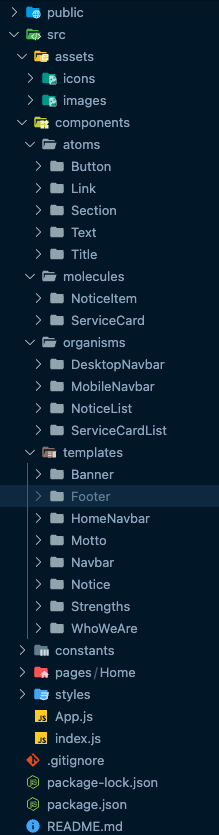

# Willender Interview

## Tech stack used in project

1. React.js
2. SCSS
3. Javascript
4. No external libraries used

## Project structure

This project follows the atomic design structure to ensure consistency and maintainable code.

The folder structure is organized as follows:

  

## Getting started

1. Clone the repository.
2. Install dependencies using
   `npm install.`
3. Run the project locally using `npm start`.

### Time taken to complete this project `~ 8 hrs to 10 hrs`

> ### Live version of this project is hosted on Netlify. Here is the [link](https://complete-project--willender-interview.netlify.app/) to access the live version.
